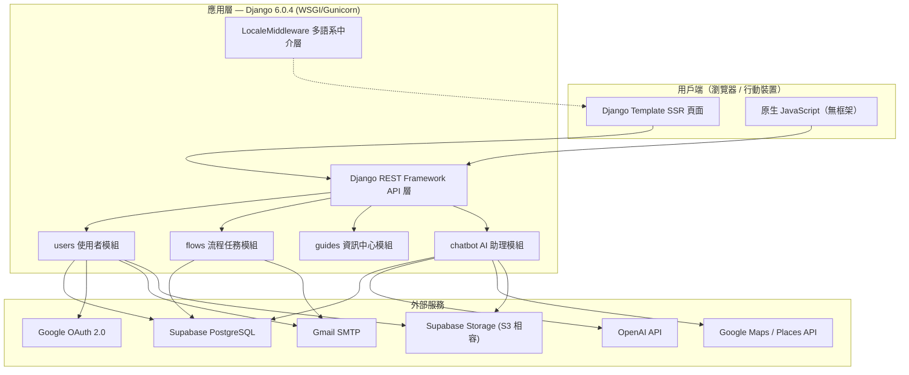
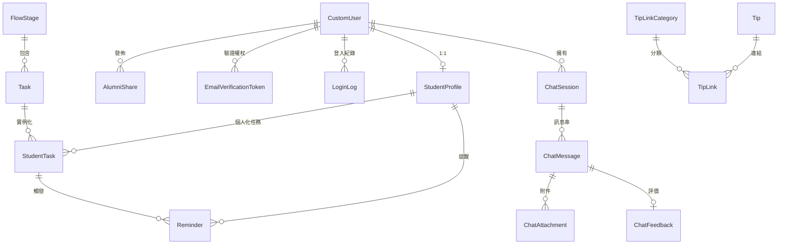

# ReadyTo Taiwan — 專案技術文件

> 本文件為論文撰寫之參考資料，內容係遍歷專案原始碼後彙整而成。
> 文件產出日期：2026-07-27　|　對應版本：master 分支（第 374 次提交）

---

## 目錄

1. [專案概述](#1-專案概述)
2. [問題背景與目標使用者](#2-問題背景與目標使用者)
3. [系統架構](#3-系統架構)
4. [技術堆疊](#4-技術堆疊)
5. [資料模型](#5-資料模型)
6. [功能模組詳述](#6-功能模組詳述)
7. [核心演算法與機制](#7-核心演算法與機制)
8. [多語系國際化設計](#8-多語系國際化設計)
9. [資訊安全設計](#9-資訊安全設計)
10. [部署架構](#10-部署架構)
11. [專案規模統計](#11-專案規模統計)
12. [已知限制與未來工作](#12-已知限制與未來工作)

---

## 1. 專案概述

### 1.1 系統名稱

**ReadyTo Taiwan**（來臺就學小幫手）

### 1.2 一句話定義

一套專為**僑生、外籍生與港澳生**設計的「來臺留學全流程數位輔導平台」，透過**個人化任務清單**、**多語系資訊中心**與**雙模式 AI 助理**，協助境外學生完成從申請、入境到在臺生活適應的完整行政流程。

### 1.3 核心價值主張

境外學生來臺就學需面對大量分散、以中文為主、且因身分別而異的行政程序。本系統的核心貢獻在於：

| 痛點 | 系統對策 |
|------|----------|
| 資訊分散於各機關網站，難以彙整 | 資訊中心：25 個結構化指南頁面 + 全文檢索 |
| 不同身分別（僑生／外籍生／港澳生）適用規定不同 | 規則式個人化引擎，依 7 項條件動態生成任務清單 |
| 中文行政術語造成語言障礙 | 9 種語言完整介面 + AI 自動偵測提問語言回覆 |
| 法定期限（如入境 30 天內辦 ARC）容易錯過 | 依抵臺日期自動推算截止日，站內通知 + Email 提醒 |
| 遇到問題無人可問、跨時區求助困難 | 全天候雙模式 AI 助理（任務小幫手／聊天好朋友） |
| 心理適應困難、思鄉壓力 | 「聊天好朋友」情緒支持模式 + 危機關鍵字安全網 |

---

## 2. 問題背景與目標使用者

### 2.1 目標使用者輪廓

系統以 `StudentProfile` 模型定義使用者屬性，涵蓋維度如下：

- **身分別（identity_type）**：僑生（overseas_chinese）、外籍生（foreign_student）、港澳生（hong_kong_macau）
- **入學狀態（admission_status）**：入臺前準備（pre_arrival）、抵臺後（arrived）
- **地區（region）**：9 大洲別區域（東亞、東南亞、南亞、中東、歐洲、北美洲、中南美洲、非洲、大洋洲）
- **國籍（nationality）**：33 個國家／地區選項
- **就讀學校（university）**：36 所臺灣公立大學（以國立中央大學 NCU 為主要實作對象）
- **進階條件**：是否持有臺灣身分證（has_taiwan_id）、是否延遲入學（is_deferred）

### 2.2 場域範圍

系統資訊內容以**國立中央大學（NCU）**為深度實作場域（宿舍、校車、圖書館、選課系統、校內急難聯絡等），行政流程（ARC、健保、工作許可、銀行開戶等）則適用全臺境外學生。

---

## 3. 系統架構

### 3.1 整體架構圖



### 3.2 架構風格

- **整體模式**：Django 傳統 MTV（Model-Template-View）**單體式架構（Monolith）**，並非前後端分離
- **混合渲染策略**：頁面骨架採 **SSR（伺服器端渲染）**，動態互動（任務勾選、AI 對話、搜尋）則透過 **REST API + fetch()** 非同步更新
- **前端**：**零框架**（無 React / Vue），僅使用原生 JavaScript 與手寫 CSS
- **API 設計**：RESTful，回應統一封裝為 `{success, message, data}` 格式

### 3.3 Django App 劃分

| App | 職責 | 是否啟用 |
|-----|------|----------|
| `users` | 帳號、認證、學生資料、學長姐分享、系所資料 | ✅ |
| `flows` | 流程階段、任務定義、個人化任務、提醒、小貼士 | ✅ |
| `guides` | 資訊中心 25 個指南頁面與全文檢索 | ✅ |
| `chatbot` | AI 對話、知識庫、附件、回饋 | ✅ |
| `processes` | **殘留空殼**，未註冊於 `INSTALLED_APPS`，`models.py` 僅 3 行 | ❌ 未使用 |

> 論文撰寫注意：`processes` 為早期開發遺留目錄，實際未參與系統運作，描述架構時應予排除。

---

## 4. 技術堆疊

### 4.1 後端核心

| 套件 | 版本 | 用途 |
|------|------|------|
| Django | 6.0.4 | Web 框架主體 |
| djangorestframework | 3.17.1 | REST API 層 |
| django-cors-headers | 4.9.0 | 跨來源資源共用控制 |
| django-modeltranslation | 0.20.3 | 資料庫欄位層級多語系 |
| django-multiselectfield | 1.0.1 | 多選欄位（任務適用條件） |
| psycopg2-binary | 2.9.12 | PostgreSQL 驅動 |
| Pillow | 12.2.0 | 頭像圖片處理 |
| deep-translator | 1.11.4 | 翻譯輔助工具 |

### 4.2 AI 與外部整合

| 套件／服務 | 版本 | 用途 |
|-----------|------|------|
| openai | 2.33.0 | AI 對話生成（預設模型 `gpt-4o-mini`，可經 `OPENAI_MODEL` 覆寫） |
| google-auth | 2.49.2 | 驗證 Google OAuth ID Token |
| requests | 2.33.1 | google-auth 傳輸依賴 |
| Google Maps / Places API | — | 「聊天好朋友」地點搜尋（餐廳、商店） |

### 4.3 部署與儲存

| 套件 | 版本 | 用途 |
|------|------|------|
| gunicorn | 23.0.0 | 生產環境 WSGI 伺服器 |
| whitenoise | 6.11.0 | 靜態檔服務（免 Nginx），採壓縮儲存後端 |
| django-storages | 1.14.6 | 媒體檔存放至 Supabase Storage |
| boto3 | 1.40.19 | S3 相容後端依賴 |
| python-dotenv | 1.2.2 | 環境變數載入 |

### 4.4 資料庫

- **PostgreSQL**（託管於 **Supabase**）
- 連線經 Supabase **Transaction-mode Pooler（port 6543）**
- `CONN_MAX_AGE = 60`（連線復用 60 秒）
- 強制 `sslmode=require`
- 測試環境自動切換為 SQLite（`if 'test' in sys.argv`）

### 4.5 前端

- **無 JavaScript 框架**：3 個原生 JS 檔（`users.js`、`flows.js`、`chatbot.js`），共 3,855 行
- **手寫 CSS**：29 個 CSS 檔，共 9,475 行；採 CSS 變數（`--primary`、`--line` 等）建立設計系統
- **響應式設計**：CSS Grid / Flexbox + Media Query，斷點主要為 1024px / 900px / 760px / 640px / 320px

---

## 5. 資料模型

### 5.1 實體關聯概觀



### 5.2 各模型說明

#### users 模組

| 模型 | 說明 |
|------|------|
| **CustomUser** | 自訂使用者模型（`AUTH_USER_MODEL`），以 **email 為帳號識別**（`USERNAME_FIELD = 'email'`）。含 `role`、`email_verified`、`last_login_ip` 等欄位 |
| **StudentProfile** | 與 CustomUser 一對一。儲存國籍、地區、學校、身分別、入學狀態、預計抵臺日期、頭像、慣用語言等**個人化引擎所需之全部輸入變數** |
| **Department** | 系所主檔，含中英雙語名稱、學院、學群分類，供 AI「課業小老師」判定學科領域 |
| **AlumniShare** | 學長姐經驗分享貼文，含學校、國籍、系所、標題、內容（上限 1000 字）、推薦指數（1–5） |
| **EmailVerificationToken** | Email 驗證權杖，儲存**雜湊值**而非明文，具 `is_used` 旗標與 24 小時有效期 |
| **LoginLog** | 登入稽核紀錄（成功／失敗、IP） |

#### flows 模組

| 模型 | 說明 |
|------|------|
| **FlowStage** | 流程階段（如「抵臺前準備」「抵達後事項」），含 `is_pre_arrival` 旗標與 `order` 排序 |
| **Task** | 任務**定義（範本）**。含適用條件欄位（region、identity_type、nationality、university、admission_status、require_taiwan_id、require_deferred）、截止日規則、所需文件、辦理地點與地址、官方連結 |
| **StudentTask** | 任務**實例**。學生與任務的多對多中介，記錄 `status`（not_started / in_progress / completed）、備註、完成時間 |
| **Reminder** | 站內提醒訊息，含已讀狀態；由 `post_save` signal 自動建立 |
| **Tip / TipLinkCategory / TipLink** | 小貼士與相關連結，可依身分別過濾 |

#### chatbot 模組

| 模型 | 說明 |
|------|------|
| **ChatSession** | 對話會話，含 `ai_mode`（helper / friend）、標題、釘選狀態 |
| **ChatMessage** | 單則訊息，`role` 為 user / assistant |
| **ChatAttachment** | 附件（圖片／檔案），有副檔名白名單與 8MB 大小限制 |
| **ChatFeedback** | 使用者對 AI 回覆的 👍／👎 評價，與訊息一對一（可覆寫） |
| **ChatKnowledge** | **檢索式知識庫**。含分類、學科、關鍵字、`bot_type`，標題與內容均有 9 語欄位 |

#### guides 模組

**無資料庫模型**。25 個指南頁面為靜態 Django Template，搜尋語料以 Python 字典（`search_data.py`，658 行）維護，含 `zh-hant` 與 `en` 兩語版本，其他語言回退至英文。

---

## 6. 功能模組詳述

### 6.1 使用者模組（users）

**REST API 端點（15 個）**

| 端點 | 功能 |
|------|------|
| `POST /api/users/register/` | 註冊（含 Email 驗證信寄送） |
| `POST /api/users/login/` | 登入 |
| `POST /api/users/logout/` | 登出 |
| `GET /api/users/me/` | 取得當前使用者 |
| `POST /api/users/profile/` | 建立學生資料 |
| `PATCH /api/users/profile/update/` | 更新學生資料 |
| `POST /api/users/change-password/` | 變更密碼 |
| `POST /api/users/password-reset/` | 請求重設密碼 |
| `POST /api/users/password-reset/confirm/` | 確認重設密碼 |
| `GET /api/users/verify-email/<token>/` | Email 驗證 |
| `POST /api/users/resend-verification/` | 重寄驗證信 |
| `POST /api/users/google-login/` | Google OAuth 登入 |
| `GET /api/users/login-logs/` | 登入紀錄查詢 |
| `DELETE /api/users/delete/` | 帳號刪除 |

**認證機制**

- 主要採 **Session-based 認證**（`SessionAuthentication`），非 JWT
- 支援 **Google OAuth 2.0**：前端以 Google Identity Services 取得 ID Token，後端以 `google-auth` 驗證後建立 session；首次登入自動建立帳號（`is_new_user`）
- Email 驗證受 `REQUIRE_EMAIL_VERIFICATION` 開關控制

### 6.2 流程任務模組（flows）

**REST API 端點（9 個）**：階段列表、任務初始化、我的任務、單筆／批次狀態更新、進度總覽、提醒列表、提醒已讀、小貼士。

**核心概念**：`Task`（範本）與 `StudentTask`（實例）分離，使管理員可調整任務定義而不破壞學生既有進度。

### 6.3 資訊中心模組（guides）

25 個指南頁面，涵蓋主題包括：

- **居留相關**：ARC（外籍生／僑生／交換生三版本）、法規、行政文件
- **生活機能**：銀行開戶、手機門號、醫療、健保（NHI）、交通（校車）、校園地圖、緊急聯絡
- **學業相關**：入學報到、選課、圖書館、校內系統、畢業、獎學金
- **其他**：住宿、工作許可、心理健康、各國專區、招生說明

搜尋功能為**前端關鍵字比對**，語料來自 `GUIDES_I18N` 標題／描述與 `search_data.py` 內文片段。

### 6.4 AI 助理模組（chatbot）

**雙人格設計**

| 模式 | 定位 | 特性 |
|------|------|------|
| **ReadyTo 任務小幫手**（helper） | 行政問題解答 | 連結學生任務進度與截止日、引用官方來源、附相關指南連結 |
| **ReadyTo 聊天好朋友**（friend） | 情緒陪伴 | 回覆切分為多則短訊模擬真人、情緒偵測、**Google Places 地點推薦** |

> 另有「課業小老師」（tutor）**角色（role）**，係於 helper 模式下透過 `_ROLE_INSTRUCTIONS` 切換之教學語氣設定，並非獨立的 `ai_mode`。

**服務層規模**：`chatbot/services.py` 共 **2,759 行**，為全專案最大單一檔案。

---

## 7. 核心演算法與機制

### 7.1 規則式個人化任務生成引擎

此為系統最具學術價值之元件，實作於 `flows/views.py:init_student_tasks_view()`。

**演算法流程**

```
輸入：StudentProfile（學生屬性）、Task 全集
輸出：該學生適用之 StudentTask 集合

步驟 1｜條件過濾（Eligibility Filtering）
  對每個 Task 逐一比對 7 項條件，任一不符即排除：
    region、identity_type、nationality、university、
    admission_status、require_taiwan_id、require_deferred
  ※ 布林條件採 _safe_bool_eq()：任務有限制但學生未作答時，
     採「保守排除」策略以避免誤派任務

步驟 2｜特異性去重（Specificity-based Deduplication）
  同一任務可能有多個版本（通用版／特定學校版）。
  以加權計分選出最精準者：
    require_taiwan_id  +32   ┐ 進階個人化條件
    require_deferred   +32   ┘ 權重最高
    university         +16
    nationality        +8
    region             +4
    identity_type      +2
    admission_status   +1
  去重鍵：task_code，若無則回退為 (title, stage_id)

步驟 3｜差異同步（Differential Sync）
  removed = 既有 − 適用   （僅刪除 status='not_started' 者，保護學生進度）
  created = 適用 − 既有
  
步驟 4｜狀態推進
  若 admission_status == 'arrived'，
  自動將 is_pre_arrival 階段之未完成任務標記為 completed
```

**設計理據**：權重採 2 的冪次（1, 2, 4, 8, 16, 32），確保高權重條件必然壓過所有低權重條件之總和，形成明確的優先序關係。

### 7.2 截止日推算與提醒排程

實作於 `flows/reminders.py:sync_task_reminders()`。

**兩種截止日型態**

| 型態 | 計算方式 |
|------|----------|
| `from_arrival` | `學生預計抵臺日 + deadline_days`（相對日期，如「入境後 30 天內」） |
| `absolute` | `deadline_date`（固定日期，如獎學金申請截止日） |

**提醒分級**：依 `due_date` 與今日比較，產生三類訊息 —— 即將到期（預設提前 3 天）、今天到期、已過期。

**去重機制**：以「訊息內含之日期字串 + 關鍵字」比對既有提醒，確保同一截止日僅提醒一次，避免 cron 每日重複寄信。提醒訊息本身依學生語言產生中／英兩版。

**排程執行**：Django management command `check_reminders`（`send_task_reminders` 已標記棄用，內部轉呼叫前者）。

### 7.3 AI 回覆生成管線

```
使用者提問
    ↓
[1] 語言偵測 detect_question_language() → choose_reply_language()
    ↓
[2] 危機關鍵字掃描 contains_crisis_keywords()（9 語）
    ↓
[3] 意圖與主題判定
    ├─ detect_info_topic()        → 對應指南頁面
    ├─ find_relevant_student_task() → 對應個人任務
    └─ detect_place_query()        → Google Places 搜尋
    ↓
[4] 上下文組裝
    ├─ build_user_profile_context()   個人資料
    ├─ build_student_flow_context()   任務進度與截止日
    ├─ build_tutor_context()          學科背景（小老師角色）
    └─ search_knowledge_base()        ChatKnowledge 關鍵字檢索（取前 3 筆）
    ↓
[5] System Prompt 建構 build_system_instructions()
    ↓
[6] OpenAI Responses API 呼叫（gpt-4o-mini，支援附件多模態）
    │   └─ 失敗時回退 local_fallback_reply()
    ↓
[7] 後處理
    ├─ friend 模式：split_friend_reply() 切分為最多 2 則短訊
    ├─ 插入指南／任務連結
    └─ 危機安全網：若命中危機關鍵字但回覆無求助電話，
       伺服器端強制附加 build_crisis_resources()
    ↓
回覆 + 追問建議 get_followup_suggestions()
```

**值得論文著墨之設計**：

1. **本地捷徑（Local Shortcut）**：部分個人化問題（如「我還有幾項任務」）由 `build_local_personal_answer()` 直接以資料庫資料回答，**不呼叫 OpenAI**，兼顧成本與準確性。惟有附件上傳或小老師角色時強制走 OpenAI。
2. **危機保底安全網**：不將學生安全交由模型自由發揮，而以伺服器端規則強制注入求助資源（含各校諮商專線 `SCHOOL_CRISIS_PHONES`），此為 AI 應用倫理之具體實踐。
3. **檢索增強（RAG-like）**：`ChatKnowledge` 採**關鍵字比對**檢索，非向量嵌入（embedding），屬輕量級實作。

---

## 8. 多語系國際化設計

系統支援 **9 種語言**：繁體中文、English、Tiếng Việt、မြန်မာဘာသာ（緬甸文）、Bahasa Indonesia、Bahasa Melayu、ไทย（泰文）、日本語、한국어。

### 8.1 雙軌翻譯策略

此為系統 i18n 架構之特點，**介面文字**與**資料內容**採不同機制：

| 層級 | 技術 | 說明 |
|------|------|------|
| **介面靜態文字** | Django `gettext` + `.po/.mo` | 模板中 `` 標記，編譯為 `.mo` 二進位檔 |
| **資料庫內容** | **欄位後綴法**（非 django-modeltranslation 動態註冊） | 於模型直接定義 `title_en`、`title_vi`、`title_my`… 等實體欄位 |

**欄位後綴法實例**（`flows/models.py:Task`）：

```python
title    = models.CharField(...)        # 繁中（預設）
title_en = models.CharField(...)        # 英文
title_my = models.CharField(...)        # 緬甸文
title_id / title_ms / title_th / title_ja / title_ko / title_vi
```

同一模式套用於 `description`、`required_documents`、`apply_location`、`apply_address`、`deadline_text` 等欄位，並以 `pick()` 輔助函式依當前語言取值、缺漏時回退繁中。

> **論文可探討之取捨**：欄位後綴法使 `Task` 模型欄位數量龐大（單一模型逾 60 欄），但換得查詢簡單（無需 JOIN）與 Admin 編輯直觀。相對地，django-modeltranslation 雖已列於依賴，實際上模型多採手動定義欄位。

### 8.2 翻譯覆蓋率

| 語言 | msgid 數量 |
|------|-----------|
| ja（日文） | 2,341 |
| ms（馬來文） | 2,247 |
| th（泰文） | 2,242 |
| vi（越南文） | 2,241 |
| id（印尼文） | 2,238 |
| ko（韓文） | 2,237 |
| en（英文） | 2,230 |
| my（緬甸文） | 2,227 |

### 8.3 語言切換機制

- 中介層：`django.middleware.locale.LocaleMiddleware`
- 切換端點：`/i18n/setlang/`（Django 內建 `set_language`）
- 使用者偏好另存於 `StudentProfile.preferred_language`
- AI 回覆語言則由 `detect_question_language()` 依提問內容動態判定，**不受介面語言限制**

---

## 9. 資訊安全設計

### 9.1 已實作之防護措施

| 面向 | 措施 |
|------|------|
| **傳輸層** | 生產環境強制 `SECURE_SSL_REDIRECT`、HSTS（1 年、含子網域、preload） |
| **Cookie** | `SESSION_COOKIE_HTTPONLY`、`SESSION_COOKIE_SECURE`、`CSRF_COOKIE_SECURE`（非 DEBUG 時）、`SameSite=Lax` |
| **標頭** | `SECURE_CONTENT_TYPE_NOSNIFF`、`X-Frame-Options`（clickjacking 中介層）、`SECURE_CROSS_ORIGIN_OPENER_POLICY = same-origin-allow-popups`（配合 Google 登入彈窗） |
| **反向代理** | `SECURE_PROXY_SSL_HEADER` 信任 `X-Forwarded-Proto` |
| **Session** | 有效期 7 天 |
| **權杖** | Email 驗證權杖以**雜湊值**儲存，具單次使用旗標與時效 |
| **上傳** | 副檔名白名單 `ALLOWED_ATTACHMENT_EXTENSIONS`、單檔上限 8MB、`DATA_UPLOAD_MAX_MEMORY_SIZE` 10MB |
| **iframe 嵌入** | `@xframe_options_sameorigin` 僅允許同源嵌入聊天頁 |

### 9.2 速率限制（Throttling）

```
anon                 300/day     未登入使用者
user                1000/day     已登入使用者
login                 10/minute  登入嘗試
register              20/hour    註冊
password_reset         5/hour    重設密碼
resend_verification    5/hour    重寄驗證信
```

### 9.3 安全評估文件

專案另有 `安全評估與改善計劃.md`（32KB），為上線前資安審查報告，內容涵蓋：

- 執行摘要與風險彙總表（Critical / High / Medium / Low 分級）
- **Critical**：git 歷史機密外洩、SECRET_KEY 佔位字串、DEBUG=True
- **High**：`ALLOWED_HOSTS=['*']` 導致 Host Header 帳號接管、Cookie 未加 Secure、Token 存 localStorage、`innerHTML` 未跳脫
- **Medium/Low**：附件驗證、CORS 設定、Serializer `fields='__all__'`、Google Maps Key 前端曝露
- 憑證輪替清單、上線 Gate 檢查表、分階段改善路線圖

> 此文件本身即為論文「系統安全性評估」章節的一手素材。

---

## 10. 部署架構

### 10.1 生產環境

| 項目 | 方案 |
|------|------|
| **應用託管** | Render（`readytotaiwan.onrender.com`） |
| **WSGI 伺服器** | Gunicorn 23.0.0 |
| **資料庫** | Supabase PostgreSQL（Transaction-mode Pooler, port 6543） |
| **靜態檔** | WhiteNoise（`CompressedStaticFilesStorage`），無需 Nginx |
| **媒體檔** | Supabase Storage（S3 相容），經 django-storages + boto3 |
| **Email** | Gmail SMTP（TLS, port 587） |

### 10.2 環境變數配置

系統以 `.env`（python-dotenv）管理組態，關鍵變數包括：
`SECRET_KEY`、`DEBUG`、`ALLOWED_HOSTS`、`SITE_BASE_URL`、`CSRF_TRUSTED_ORIGINS`、`DB_*`、`SUPABASE_S3_*`、`OPENAI_API_KEY`、`GOOGLE_MAPS_API_KEY`、`GOOGLE_CLIENT_ID`、`EMAIL_*`、`REQUIRE_EMAIL_VERIFICATION`。

### 10.3 CI／排程

- **GitHub Actions**：`keep-alive.yml` 每日 UTC 03:00（臺灣時間 11:00）對 Supabase 執行一次唯讀計數查詢，避免免費方案因閒置約 7 天被自動暫停。
- **提醒排程**：`python manage.py check_reminders` 需由外部 cron 觸發。

---

## 11. 專案規模統計

### 11.1 程式碼行數

| 類別 | 行數 |
|------|------|
| Python（不含 migrations） | 9,600 |
| HTML Template | 9,493 |
| CSS | 9,475 |
| JavaScript | 3,855 |
| **合計** | **約 32,423 行** |

### 11.2 檔案統計

| 項目 | 數量 |
|------|------|
| Python 檔（不含 migrations） | 43 |
| HTML 模板 | 42 |
| CSS 檔 | 29 |
| JavaScript 檔 | 3 |
| 資料模型（Model 類別） | 18 |
| REST API 端點 | 約 31 |
| 指南頁面 | 25 |
| 支援語言 | 9 |
| Git 提交次數 | 374 |

### 11.3 最大單一檔案

| 檔案 | 行數 | 說明 |
|------|------|------|
| `chatbot/services.py` | 2,759 | AI 服務層（提示詞、語言偵測、知識檢索、危機處理） |
| `users/static/users/css/users.css` | 約 3,500 | 全站共用樣式 |
| `guides/search_data.py` | 658 | 指南搜尋語料 |

---

## 12. 已知限制與未來工作

### 12.1 目前限制

| 項目 | 說明 |
|------|------|
| **知識庫檢索** | `ChatKnowledge` 採關鍵字比對而非向量嵌入，語意檢索能力有限 |
| **搜尋功能** | 資訊中心搜尋為前端字串比對，無倒排索引或分詞，中文檢索精度受限 |
| **測試覆蓋** | 各 app 之 `tests.py` 多為 Django 預設空殼，缺乏自動化測試 |
| **非同步處理** | AI 呼叫與寄信皆為同步阻塞（程式碼註解已標示「可改為 Celery 非同步」） |
| **殘留程式碼** | `processes` app 未使用；`send_task_reminders` 命令已棄用 |
| **i18n 資料層** | 欄位後綴法導致模型欄位膨脹，新增語言需資料庫遷移 |
| **前端架構** | 無模組打包工具，JS 以全域函式組織，`users.js` 規模已偏大 |

### 12.2 可延伸之研究方向

1. **個人化引擎優化**：現行為規則式（rule-based），可探討引入協同過濾或機器學習，依同背景學生的實際完成路徑推薦任務順序。
2. **向量檢索升級**：將 `ChatKnowledge` 改為 embedding + 向量資料庫（如 pgvector），提升跨語言語意檢索準確度。
3. **AI 回覆品質評估**：`ChatFeedback` 已蒐集 👍／👎 資料，可作為回覆品質量化分析與提示詞迭代之依據。
4. **使用者行為分析**：結合 `StudentTask` 狀態變更時序與 `LoginLog`，分析境外學生行政流程之實際瓶頸點。
5. **無障礙與行動優先**：現行 RWD 為後補式改造，可探討 mobile-first 重構之成效差異。

---

## 附錄：快速查閱索引

| 想了解… | 查看檔案 |
|---------|----------|
| 個人化任務演算法 | `flows/views.py` → `init_student_tasks_view()` |
| 截止日與提醒邏輯 | `flows/reminders.py` → `sync_task_reminders()` |
| AI 提示詞工程 | `chatbot/services.py` → `build_system_instructions()` |
| 危機處理安全網 | `chatbot/services.py` → `contains_crisis_keywords()`、`build_crisis_resources()` |
| 資料模型定義 | `users/models.py`、`flows/models.py`、`chatbot/models.py` |
| 系統組態 | `studygo/settings.py` |
| 資安評估 | `安全評估與改善計劃.md` |
| 路由總表 | `studygo/urls.py`、各 app 之 `urls.py` / `api_urls.py` |
